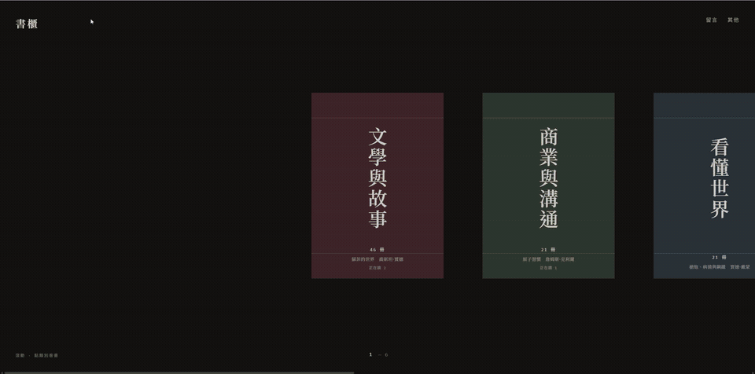

# bookshelf — 書櫃

實體書櫃的線上目錄：約 100 本藏書，橫向書牆＋分類展覽兩種視圖，
書封是自己拍的（`covers/`，webp）。

線上版：https://bookshelf-nine-gamma.vercel.app

從書櫃滾到類別、推開封面廊道、翻開一本書。
（[高畫質 MP4](docs/demo.mp4)）

六個分類橫向排開，每張卡標著冊數與正在讀的書。滾動切換、點類別進去看書。

點一本書會攤開它的檔案：出版資訊、在書櫃的哪一層、怎麼擺（平放／立放），
以及大綱、書裡的觀點、各界評價與我自己的評語。

## 結構

單檔 `index.html`——版面、資料與互動都在裡面。
`catalogue-draft.md` 是編目草稿，標了封面朝外的書（＝正在讀）。

`covers/` 是自己拍的書封（webp）；原始照片（`raw/`）約 300MB，不進版本庫。
